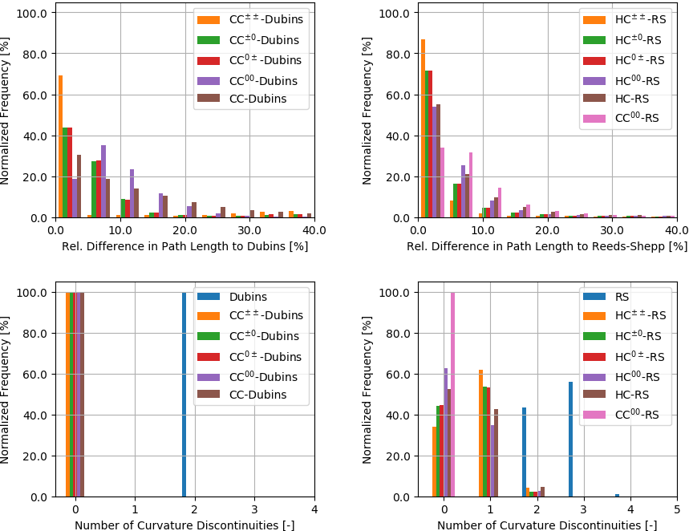

# Steering Functions for Car-Like Robots

## Overview

This package contains a C++ library that implements the following steering functions for car-like robots with limited turning radius (CC = continuous curvature, HC = hybrid curvature):

Steering Function           | Driving Direction          | Continuity       | Optimization Criterion
:---                        | :---                       | :---                       | :---
Dubins                      | forwards **or** backwards  | G1 | path length (optimal)
CC-Dubins                   | forwards **or** backwards  | G2 | path length (suboptimal)
Reeds-Shepp                 | forwards **and** backwards | G1 | path length (optimal)
HC-Reeds-Shepp              | forwards **and** backwards | G2 btw. cusps | path length (suboptimal)
CC-Reeds-Shepp              | forwards **and** backwards | G2 | path length (suboptimal)

The package contains a [RViz] visualization, which has been tested with [ROS 1] Kinetic under Ubuntu 16.04.

A video of the steering functions integrated into the general motion planner Bidirectional RRT* can be found [here](https://youtu.be/RlZZ4jnEhTM).

For contributions, please check the instructions in [CONTRIBUTING](CONTRIBUTING.md).

## Purpose of the project

This software is a research prototype, originally developed for and published
as part of the publication [2].

The software is not ready for production use. It has neither been developed nor
tested for a specific use case. However, the license conditions of the
applicable Open Source licenses allow you to adapt the software to your needs.
Before using it in a safety relevant setting, make sure that the software
fulfills your requirements and adjust it according to any applicable safety
standards (e.g. ISO 26262).

## Publications
If you use one of the above steering functions in your work, please cite the appropriate publication:

[1] H. Banzhaf et al., **"From Footprints to Beliefprints: Motion Planning under Uncertainty for Maneuvering Automated Vehicles in Dense Scenarios,"** in IEEE International Conference on Intelligent Transportation Systems, 2018.

[2] H. Banzhaf et al., **"Hybrid Curvature Steer: A Novel Extend Function for Sampling-Based Nonholonomic Motion Planning in Tight Environments,"** in IEEE International Conference on Intelligent Transportation Systems, 2017.

[3] L. E. Dubins, **"On Curves of Minimal Length with a Constraint on Average Curvature, and with Prescribed Initial and Terminal Positions and Tangents,"** in American Journal of Mathematics, 1957.

[4] J. Reeds and L. Shepp, **"Optimal paths for a car that goes both forwards and backwards,"** in Pacific Journal of Mathematics, 1990.

[5] T. Fraichard and A. Scheuer, **"From Reeds and Shepp's to Continuous-Curvature Paths,"** in IEEE Transactions on Robotics, 2004.

## License

The source code in this package is released under the Apache-2.0 License. For further details, see the [LICENSE](LICENSE) file.

The [3rdparty-licenses.txt](3rd-party-licenses.txt) contains a list of other open source components included in this package.

## Dependencies
This package depends on the linear algebra library [Eigen], which can be installed by

    sudo apt-get install libeigen3-dev

The [ROS 1] or [ROS 2] dependencies are listed in the package.xml and can be installed by

    rosdep install steering_functions

## Installation & Usage as a [ROS 1] or [ROS 2] package

### Building

To build this package from source, clone it into your workspace and compile it in *Release* mode according to

    cd my_ws/src
    git clone https://github.com/hbanzhaf/steering_functions.git
    catkin build steering_functions -DCMAKE_BUILD_TYPE=Release  # [ROS 1]
    colcon build --packages-up-to steering_functions --cmake-args -DCMAKE_BUILD_TYPE=Release  # [ROS 1] or [ROS 2]

To launch a [ROS 1] demo of the package, execute

    source my_ws/devel/setup.bash
    roslaunch steering_functions steering_functions.launch

### Linking

Add this package as dependency to your package's `package.xml`

    <depend>steering_functions</depend>

To link this library with another [ROS 1] package, add these lines to your package's CMakeLists.txt

    find_package(catkin REQUIRED COMPONENTS steering_functions)
    include_directories(${catkin_INCLUDE_DIRS})
    target_link_libraries(${PROJECT_NAME}_node ${catkin_LIBRARIES})

Or for [ROS 2]:

    find_package(steering_functions REQUIRED)
    target_link_libraries(your_target steering_functions::steering_functions)

Now the steering functions can be used in your package by including the appropriate header, e.g.

    #include "steering_functions/hc_cc_state_space/hc00_reeds_shepp_state_space.hpp"

### Testing

To build the [ROS 1] unit tests, execute

    catkin build steering_functions -DCMAKE_BUILD_TYPE=Release --make-args tests

To run a single test, e.g. the timing test, execute

    cd my_ws/devel/lib/steering_functions
    ./timing_test

## Installation & Usage as a standalone library

### Dependencies
This package depends on the linear algebra library [Eigen], which can be installed by

    sudo apt-get install libeigen3-dev

### Building

To build this package from source, clone it and compile it in *Release* mode without ROS support according to

    git clone https://github.com/hbanzhaf/steering_functions.git
    cd steering_functions/
    mkdir build && cd build/
    cmake .. -DCMAKE_BUILD_TYPE=Release -DBUILD_WITH_ROS=OFF
    cmake --build . --parallel
    cmake --install .

A shared library (libsteering_functions.so) can be built instead of the default static library (libsteering_functions.a) by

    cmake .. -DCMAKE_BUILD_TYPE=Release -DBUILD_WITH_ROS=OFF -DBUILD_SHARED_LIBS=ON

### Linking

To link this library to another C++ library/executable, add these lines to your CMakeLists.txt

    find_package(steering_functions CONFIG REQUIRED)
    target_link_libraries(${PROJECT_NAME}
      steering_functions::steering_functions
    )

Now the steering functions can be used in your project by including the appropriate header, e.g.

    #include <steering_functions/hc_cc_state_space/hc00_reeds_shepp_state_space.hpp>

## Documentation
### Conventions
In this implementation, a path is described by *N* segments. Each segment is given by the open-loop control inputs **u***k* = *[delta_sk, kappak, sigmak]T*, where *k = 1...N* iterates over the *N* segments, *delta_sk* describes the signed arc length of segment *k*, *kappak* the curvature at the beginning of segment *k*, and *sigmak* the linear change in curvature along segment *k*.

The states of the robot can be obtained with a user-specified discretization by forward integrating the open-loop controls **u***k*. A robot state consists of **x** = *[x, y, theta, kappa, d]T*, where *x, y* describe the center of the rear axle, *theta* the orientation of the robot, *kappa* the curvature at position *x, y*, and *d* the driving direction ({-1,0,1}).

In addition to that, this package is capable of computing a Gaussian belief along the nominal path given an initial belief, the motion and measurement noise, and a feedback controller. A belief *bel*(**x**) is described by the mean *mu*, the covariance of the state estimate *Sigma*, the distribution over state estimates *Lambda*, and the total covariance *Sigma + Lambda*. Further details can be found in [1].

### Start and Goal State
All steering functions expect a start state **x***s* = *[xs, ys, thetas, kappas, ds]T* and a goal state **x***g* = *[xg, yg, thetag, kappag, dg]T* as input. Note that the initial and final driving direction are selected by the steering function according to the computed path. They can not be selected manually, therefore, leave *ds* = *dg* = 0.

Depending on the two superscripts in the name of the steering function (see Section *Computation Times* for an overview), a different curvature is applied to the start (first superscript) and goal state (second superscript). The superscript 0 denotes that zero curvature is enfored no matter which curvature is given at that state. The superscript ± indicates that either positive or negative max. curvature is selected by the steering function if the user inputs no curvature. However, if a non-zero curvature is assigned, the steering function computes that path with the corresponding signed max. curvature. This feature can be useful in sampling-based motion planners when cuvature continuity has to be ensured at the connection of two extensions.

Additionally, the steering functions CC-Dubins and HC-Reeds-Shepp compute a path that takes into account an arbitrary start and goal curvature specified by the user.

### Statistics
A benchmark of the G2 continuous steering functions against their G1 continuous counterpart is illustrated in the following histograms (105 random steering procedures, max. curvature = 1 m-1, max. sharpness = 1 m-2.). The first row shows a comparison of the path length, and the second row compares the number of curvature discontinuities in the computed path:

### Computation Times
The following table shows the current computation times of the implemented steering functions, which are obtained from 105 random steering procedures on a single core of an Intel Xeon E5@3.50 GHz, 10 MB cache:

Steering Function           | mean [µs] | std [µs]
:---                        | :---      | :---
Dubins                      | 1.3       | ±0.8
CC±±-Dubins      | 7.1       | ±3.1
CC±0-Dubins      | 5.6       | ±1.5
CC0±-Dubins      | 5.6       | ±1.6
CC00-Dubins      | 4.9       | ±1.5
CC-Dubins                   | 14.8      | ±4.3
---                         | ---       | ---
Reeds-Shepp                 | 7.4       | ±1.7
HC±±-Reeds-Shepp | 58.1      | ±10.1
HC±0-Reeds-Shepp | 56.4      | ±8.8
HC0±-Reeds-Shepp | 51.0      | ±10.2
HC00-Reeds-Shepp | 55.9      | ±9.5
HC-Reeds-Shepp              | 464.3     | ±72.8
CC00-Reeds-Shepp | 53.8      | ±8.4

### Interfacing with OMPL
In order to use the continuous and hybrid curvature state spaces along with [OMPL], a new OMPL state space has to be created as described [here](http://ompl.kavrakilab.org/2012/03/18/geometric-planning-for-car-like-vehicles.html). OMPL requires a distance and an interpolate function, which are provided in this package.

## Bugs & Feature Requests
Please use the [Issue Tracker](https://github.com/hbanzhaf/steering_functions/issues) to report bugs or request features.

[ROS 1]: http://www.ros.org
[ROS 2]: https://docs.ros.org/en/rolling/
[RViz]: http://wiki.ros.org/rviz
[OMPL]: http://ompl.kavrakilab.org/
[Eigen]: http://eigen.tuxfamily.org/
