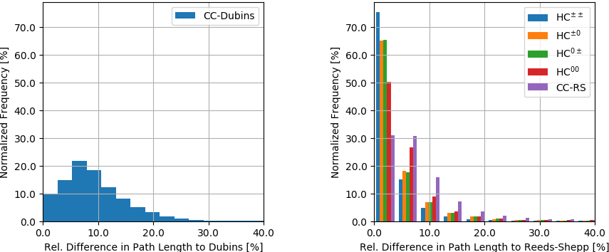

# Steering Functions for Car-Like Robots

## Overview

This package contains a C++ library that implements the following steering functions for car-like robots with limited turning radius (CC = continuous curvature, HC = hybrid curvature):

Steering Function           | Driving Direction          | Curvature Continuity       | Optimization Criterion
:---                        | :---                       | :---                       | :---
CC-Dubins                   | forwards **or** backwards  | continuous                 | path length (suboptimal)
Dubins                      | forwards **or** backwards  | discrete                   | path length (optimal)
CC-Reeds-Shepp              | forwards **and** backwards | continuous                 | path length (suboptimal)
HC-Reeds-Shepp*  | forwards **and** backwards | continuous except at cusps | path length (suboptimal)
Reeds-Shepp                 | forwards **and** backwards | discrete                   | path length (optimal)

* HC-Reeds-Shepp is given with all its derivatives, namely HC00, HC0±, HC±0, and HC±±, where the superscript indicates the curvature at the start and goal configuration (± stands for maximum positive or negative curvature).

The package contains a [RViz] visualization, which has been tested with [ROS] Kinetic under Ubuntu 16.04.

A video of the steering functions integrated into the general motion planner Bidirectional RRT* can be found [here](https://youtu.be/RlZZ4jnEhTM).

For contributions, please check the instructions in [CONTRIBUTING](CONTRIBUTING.md).

## Purpose of the project

This software is a research prototype, originally developed for and published
as part of the publication (Banzhaf, 2017).

The software is not ready for production use. It has neither been developed nor
tested for a specific use case. However, the license conditions of the
applicable Open Source licenses allow you to adapt the software to your needs.
Before using it in a safety relevant setting, make sure that the software
fulfills your requirements and adjust it according to any applicable safety
standards (e.g. ISO 26262).

## Publications
If you use one of the above steering functions in your work, please cite the appropriate publication:

[1] H. Banzhaf et al., **"Hybrid Curvature Steer: A Novel Extend Function for Sampling-Based Nonholonomic Motion Planning in Tight Environments"**, in IEEE International Conference on Intelligent Transportation Systems, 2017.

[2] L. E. Dubins, **"On Curves of Minimal Length with a Constraint on Average Curvature, and with Prescribed Initial and Terminal Positions and Tangents"**, in American Journal of Mathematics, 1957.

[3] T. Fraichard and A. Scheuer, **"From Reeds and Shepp's to Continuous-Curvature Paths"**, in IEEE Transactions on Robotics, 2004.

[4] J. Reeds and L. Shepp, **"Optimal paths for a car that goes both forwards and backwards"**, in Pacific Journal of Mathematics, 1990.

## License

The source code in this package is released under the Apache-2.0 License. For further details, see the [LICENSE](LICENSE) file.

The [3rdparty-licenses.txt](3rd-party-licenses.txt) contains a list of other open source components included in this package.

## Installation & Usage
### Building

To build this package from source, clone it into your catkin workspace and compile it in *Release* mode according to

    cd catkin_ws/src
    git clone https://github.com/hbanzhaf/steering_functions.git
    catkin build steering_functions -DCMAKE_BUILD_TYPE=Release

To launch a demo of the package, execute

    source catkin_ws/devel/setup.bash
    roslaunch steering_functions steering_functions.launch

### Linking

To link this library with another [ROS] package, add these lines to your package's CMakeLists.txt

    add_compile_options(-std=c++11)
    find_package(catkin REQUIRED COMPONENTS
      steering_functions
    )
    include_directories(
      ${catkin_INCLUDE_DIRS}
    )
    target_link_libraries(${PROJECT_NAME}_node
      ${catkin_LIBRARIES}
    )

and the following lines to your package's package.xml

    <build_depend>steering_functions</build_depend>
    <run_depend>steering_functions</run_depend>

Now the steering functions can be used in your package by including the appropriate header, e.g.

    #include "steering_functions/hc_cc_state_space/hc00_reeds_shepp_state_space.hpp"

### Testing

To run the unit test, exectue

    catkin build steering_functions -DCMAKE_BUILD_TYPE=Debug --make-args tests
    cd catkin_ws/devel/lib/steering_functions
    ./utest

## Documentation
### Conventions
In this implementation, a path is given by *N* segments. Each segment can be described by the open-loop control inputs **u***k* = *[delta_sk, kappak, sigmak]T*, where *k = 1...N* iterates over the *N* segments, *delta_sk* describes the signed arc length of segment *k*, *kappak* the curvature at the beginning of segment *k*, and *sigmak* the linear change in curvature along segment *k*.

The states of the robot can be obtained with a user-specified discretization by forward integrating the open-loop controls **u***k*. A robot state consists of **q** = *[x, y, theta, kappa, d]T*, where *x, y* describe the center of the rear axle, *theta* the orientation of the robot, *kappa* the curvature at position *x, y*, and *d* the driving direction ({-1,0,1}).

### Start and Goal State
All steering functions expect a start state **q***s* = *[xs, ys, thetas, kappas, ds]T* and a goal state **q***g* = *[xg, yg, thetag, kappag, dg]T* as input. 

The steering functions CC-Dubins, Dubins, CC-Reeds-Shepp, HC00-Reeds-Shepp, and Reeds-Shepp only expect initial and final position and orientation (no curvature, no driving direction). In this case, it is recommended to set *kappas* = *ds* = *kappag* = *dg* = 0, and the steering function will select the appropriate values.

In addition to that, HC±0-, HC0±-, and HC±±-Reeds-Shepp allow to assign the signed maximum curvature to the start (HC±0), goal (HC0±), or to the start and goal state (HC±±). This feature can be useful in sampling-based motion planners when cuvature continuity has to be ensured at the connection of two extensions. If this feature is not desired, just set *kappas* = *kappag* = 0 and the steering function selects the initial and final curvature that minimizes the path length.

### Path Length Comparison
Since CC-Dubins, CC-Reeds-Shepp, and HC-Reeds-Shepp do not satisfy any strict optimization criterion anymore, the following two histograms compare them against their optimal counterpart (105 random steering procedures, max. curvature = 1 m-1, max. sharpness = 1 m-2.):

### Computation Times
The following table shows the current computation times of the implemented steering functions, which are obtained from 105 random steering procedures on a single core of an Intel Xeon E5@3.50 GHz, 10 MB cache:

Steering Function           | mean [µs] | std [µs]
:---                        | :---      | :---
CC-Dubins                   | 3.7       | ±1.2
Dubins                      | 1.1       | ±0.3
CC-Reeds-Shepp              | 52.6      | ±7.8
HC00-Reeds-Shepp | 54.4      | ±7.7
HC0±-Reeds-Shepp | 55.1      | ±8.2
HC±0-Reeds-Shepp | 55.5      | ±8.3
HC±±-Reeds-Shepp | 55.4      | ±8.9
Reeds-Shepp                 | 7.0       | ±1.8

## Bugs & Feature Requests
Please use the [Issue Tracker](https://github.com/hbanzhaf/steering_functions/issues) to report bugs or request features.

[ROS]: http://www.ros.org
[RViz]: http://wiki.ros.org/rviz
